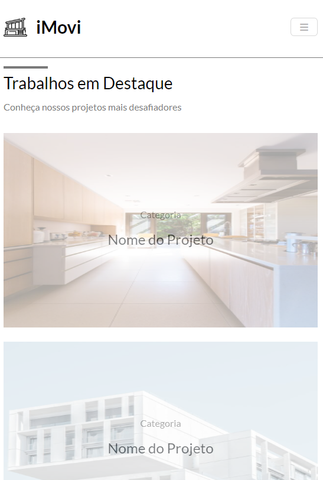

# iMovi

This project is a static page, created using HTML, CSS and Bootstrap.

## [Click here](https://i-movi-fronchak-projects.vercel.app) to go to the project page

## How to set up
1. Clone this project to your machine
2. Go to the project's folder
3. Double click in the 'index.html' file to open it in your browser

## Images

### Main banner (Desktop)

### Main banner (Mobile)

### Projects (Desktop)

### Projects (Mobile)

### Bottom (Desktop)

### Bottom (mobile)

### Footer (mobile)
